<!-- Enable Mathjax

-->

# High-Dynamic-Range Imaging ([CS766 Spring 2017](http://pages.cs.wisc.edu/~mohitg/courses/CS766/))
In this project, we build an HDR imaging software. The project consists of bracket exposure photo captures, radiance estimation and tone mapping. We have not only impelemented the HDR imaging algorithms but also built a complete computer vision systems on an Android phone, including both the image sensing part and the post processing part. We run experiments on a variety of photos from DLSR and Android phones.

## Exposure Estimation
During the image formation procedure of modern digital cameras, the original radiance (illumination of the objects) is nonlinearly mapped to the photo. We denote the nonlinear process by a function f, and then the relationship between the scene radiance and the pixel values is Z = f(Et), where (Z, E) is the digital value-radiance pair and t is the exposure time.
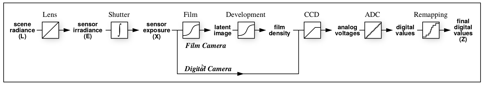
Image formation. __source: [1]__

As our goal is remapping Z to E, we rewrite the formula as g(Z) = ln f^{-1} (Z) = ln E + ln t. The function g is called the response function. Notice g is discrete and its domain is {0,1,2,...,256}, and there are n unknwon variables and mn equations, where m is the number of burst images and n is the number of pixels. We format estimating g and E as an optimizaiton problem,
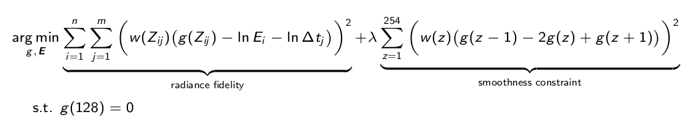

The first term is to make the Z, E equations hold with the least error and the second term is a smooth constriant to make the function g continuous and monotonic. The following flowchart shows the steps of recovery of the response function.
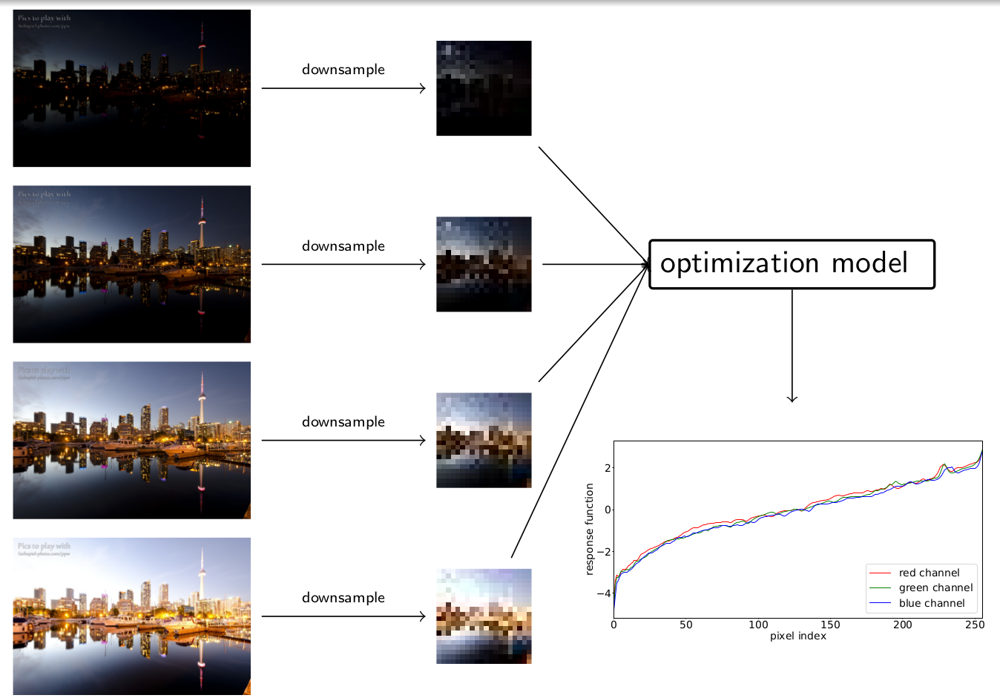

After getting the response function, we apply it to the source images, minus the exposure time compensation and do a weighted average. Finally we get the log of scene radiance. We perform the radiance estimation for each color channel independently.
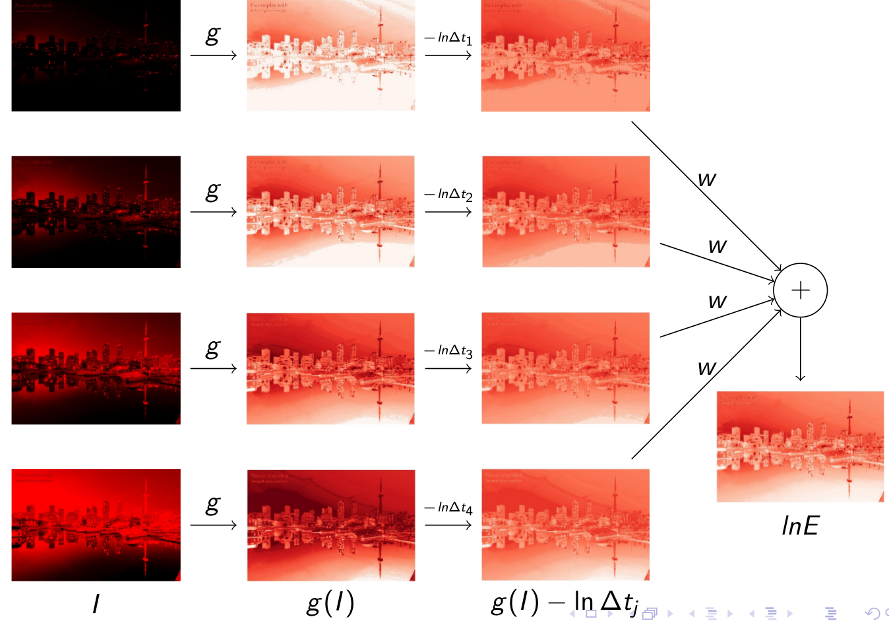

## Tone mapping
Now we have the radiance estimate for the three RGB channels, but simply rescaling the radiance to [0,255] is not feasible. In the previous example, the radiance range is [0.12656, 667.55] and the dynamic range is 5274.4. Mapping [0.12656, 667.55] to [0, 255] would leave most pixels with very small values, making the whole images appear extremely underexposure. To handle the large dynamic range, we need a tone mapping process.

Before tone mapping, we convert the image from the RGB color space to the [LAB color space](https://en.wikipedia.org/wiki/Lab_color_space). The first channel (L) of LAB is lightness of the image, and thus we only need to do tone mapping on the L channel.
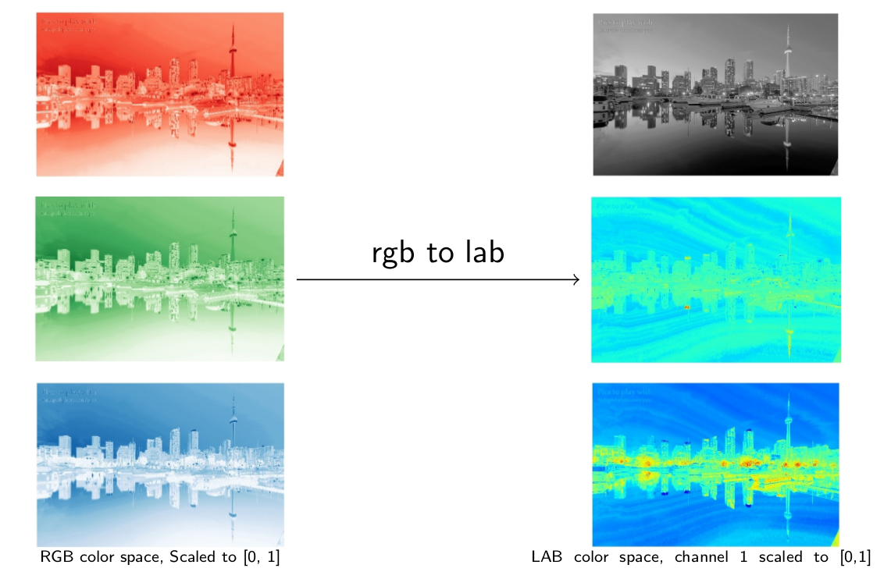

The tone mapping algorithm in our project is [Contrast Limited Adaptive Histogram Equalization](https://en.wikipedia.org/wiki/Adaptive_histogram_equalization). The idea of this algorithm is to redistribute the image range based on histogram. For pixel values with a higher frequency, we assign a wider range. Below is the process of tone mapping. We divide the image into 4 x 4 tiles. Within each tile, we compute the histogram and use the cumulative histogram as the
mapping function. We apply the tone mapping function to the lightness map and do a bilinear interploation. The result is the contrast-enhanced lightness image.
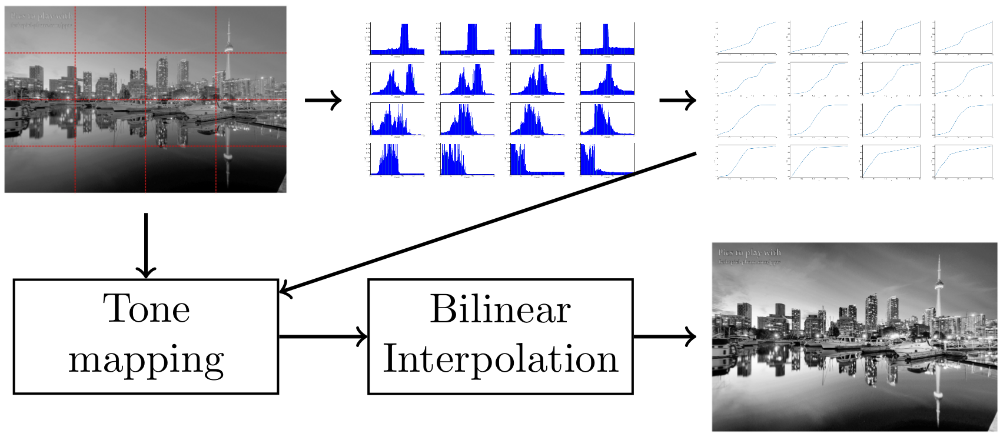

The reason to do a bilinear interpolation is that the different mapping functions in different tiles will cause discontinuity. Therefore for each pixel, we compute its mapped values from four surrounding tile mappings and average these values using bilinear interpolation.
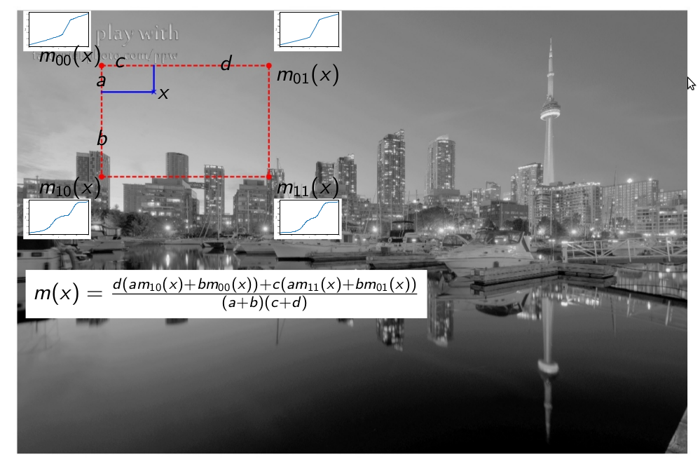

The last steps are gamma correction on the L channel and saturation adjustment on the other two channels. Converting back to the RGB color space, we get the HDR image.
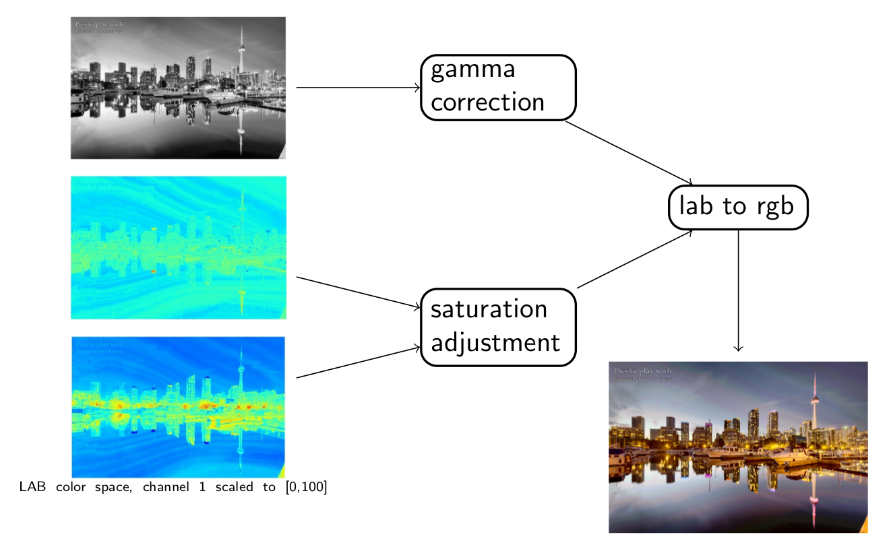

## Deploy on Android phones
We build a prototype of the HDR imaging app on an Android phone (Nexus 6P). We do not code from the scratch. Instead we build the app based on an opensource software -- [OpenCamera](http://opencamera.sourceforge.net/). The opencamera takes care of all the Android camera hardware configuration including auto-focus, auto-exposure and white-balance. What we do is to set the expsoure times of the bracketing images to 0.5t, t, 2t. Here t is the normal expsoure time. We
replace the software's original HDR implementaion with our algorithm. Some results from the Android app are shown in the Gallary section.

## [Presentation Slides](files/Zhang.Huayu.slides.pdf)

## Gallary
### DLSR
Big City Lights
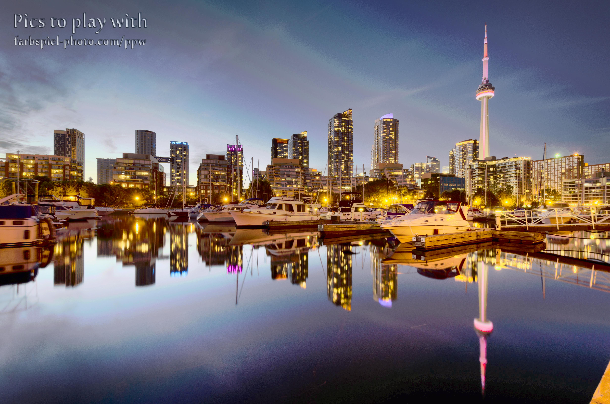
Raw images:[1](data/Big_City_Lights/Big_City_Lights-ppw-01.jpg) [2](data/Big_City_Lights/Big_City_Lights-ppw-02.jpg) [3](data/Big_City_Lights/Big_City_Lights-ppw-03.jpg) [4](data/Big_City_Lights/Big_City_Lights-ppw-04.jpg)

Izmir Harbor
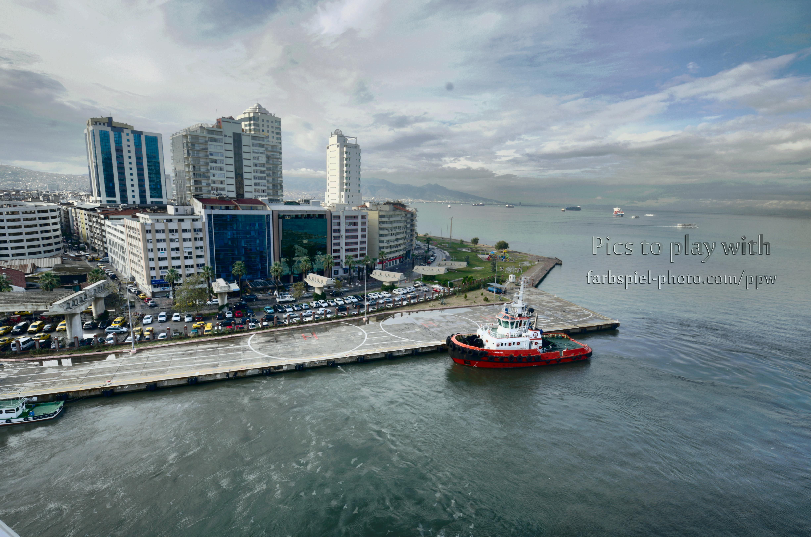
Raw images:[1](data/Izmir_Harbor/Izmir_Harbor-ppw-01.jpg) [2](data/Izmir_Harbor/Izmir_Harbor-ppw-02.jpg) [3](data/Izmir_Harbor/Izmir_Harbor-ppw-03.jpg) [4](data/Izmir_Harbor/Izmir_Harbor-ppw-04.jpg)  [5](data/Izmir_Harbor/Izmir_Harbor-ppw-05.jpg) [6](data/Izmir_Harbor/Izmir_Harbor-ppw-06.jpg) 

Big City Lights
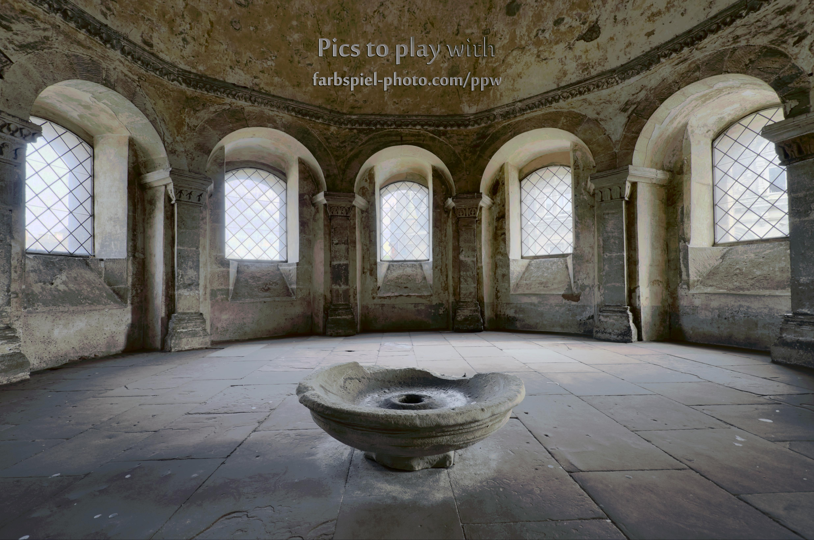
Raw images:[1](data/High_Five/High_Five-ppw-01.jpg) [2](data/High_Five/High_Five-ppw-02.jpg) [3](data/High_Five/High_Five-ppw-03.jpg) [4](data/High_Five/High_Five-ppw-04.jpg) [5](data/High_Five/High_Five-ppw-05.jpg) [6](data/High_Five/High_Five-ppw-06.jpg) [7](data/High_Five/High_Five-ppw-07.jpg) [8](data/High_Five/High_Five-ppw-08.jpg)

Big City Lights
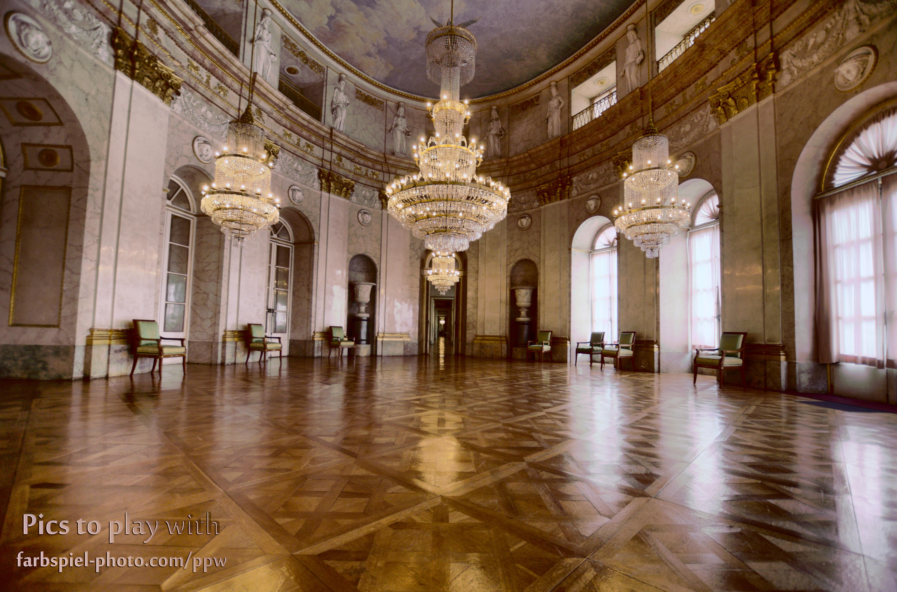
Raw images:[1](data/The_Marble_Hall/The_Marble_Hall-ppw-01.jpg) [2](data/The_Marble_Hall/The_Marble_Hall-ppw-02.jpg) [3](data/The_Marble_Hall/The_Marble_Hall-ppw-03.jpg) [4](data/The_Marble_Hall/The_Marble_Hall-ppw-04.jpg) [5](data/The_Marble_Hall/The_Marble_Hall-ppw-05.jpg) [6](data/The_Marble_Hall/The_Marble_Hall-ppw-06.jpg)

Source image credits: <http://farbspiel-photo.com/learn/hdr-pics-to-play-with>
### Android phones
UW-Madison CS basement
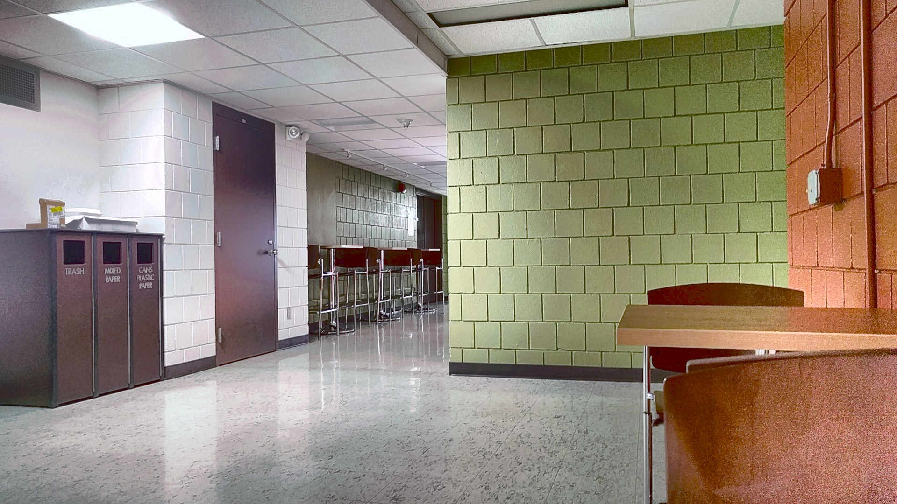
Raw images:[1](result/android/IMG_20170420_220249_EXP0.jpg) [2](result/android/IMG_20170420_220249_EXP1.jpg) [3](result/android/IMG_20170420_220249_EXP2.jpg)

UW-Madison CS Department
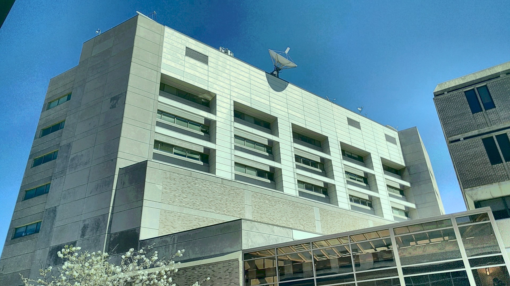
Raw images:[1](result/android/IMG_20170422_124742_EXP0.jpg) [2](result/android/IMG_20170422_124742_EXP1.jpg) [3](result/android/IMG_20170422_124742_EXP2.jpg)

UW-Madison W Dayton St in south of CS
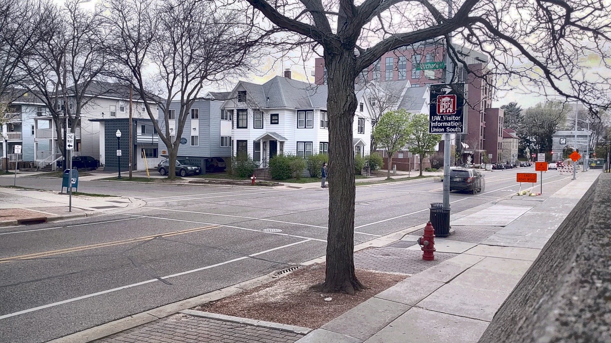
Raw images:[1](result/android/IMG_20170421_191455_EXP0.jpg) [2](result/android/IMG_20170421_191455_EXP1.jpg) [3](result/android/IMG_20170421_191455_EXP2.jpg)

## References
<ol>
    <li> Paul E Debevec and Jitendra Malik. “Recovering high dynamic range radiance
maps from photographs”. In: ACM SIGGRAPH 2008 classes. ACM. 2008, p. 31.</li>
    <li> Karel Zuiderveld. “Graphics Gems IV”. In: ed. by Paul S. Heckbert. San Diego, CA, USA: Academic Press Professional, Inc., 1994. Chap. Contrast Limited Adaptive Histogram Equalization, pp. 474–485. isbn: 0-12-336155-9.</li>
</ol>
